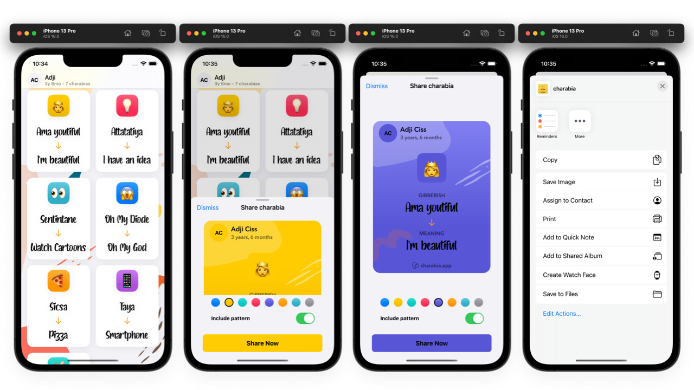

# Charabia POC using some iOS16 APIs

# Description:
Charabia is an app that allows parents to save and share what their kids are saying while learning to speak. `Charabia` is a french term that means gibberish.

# Important notes:
The project is built with `Xcode 14 beta 1`.

There is a lot of SwiftUI issues that will be worked on as new betas arrive. For now it compile and will use the best & latest features of Swift 5.7 and SwiftUI.

# New iOS16 APIs used:
* `presentationDetents` to show the sheet in medium and large size
* `ImageRenderer` to convert the charabia card view to a SwiftUI image
* `ShareLink` to share the card image using an activity controller
* Usage of the new `.gradient` modifier for colors

# Known issues:
The `ShareLink` doesn't allow for now to save the image to your photo library. This might be a bug and I already filed a radar for that. Hope it's going to be fixed before the public release. 🤞
